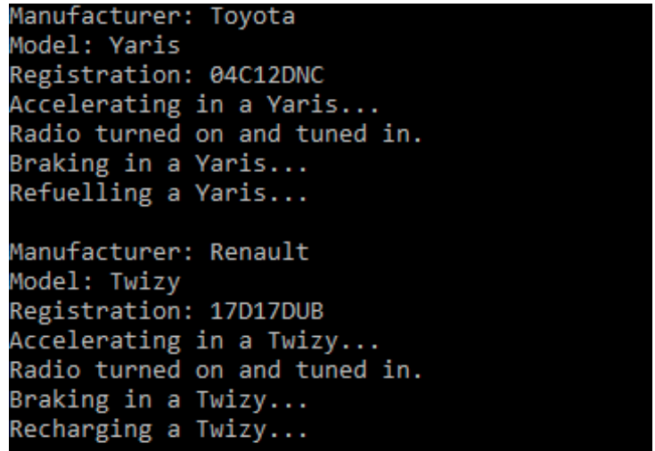

### Assignment 6.1

You are creating an application to model your favourite fruits (Orange and Banana).
You wish to store the name, colour and origin of the fruit.
Each of your favourite fruits should have peel functionality (the ability to be peeled).
You have established that peel behaviour is the same across all types of fruit.

* Use your understanding of object-oriented programming, to come up with an
optimal design, to model the attributes of your favourite fruits and their behaviour.
* Your solution should include the use of (a) constructors (b) accessor and mutator
methods.
* An ArrayList should be used to store the object references representing your
favourite fruits.

### Assignment 6.2
You are creating an application to model your favourite vegetables (Carrot, Pea, and
Corn).
For each vegetable, you wish to store (a): the name of the vegetable and (b): the
name of the vegetable family, which it is a member of.

| Vegetable | Vegetable Family |
| --------- | ---------------- |
|   Carrot  |   Apiaceae       |
|   Pea     |   Legumes        |
|   Corn    |   Gramineae      |


Each of your favourite vegetables should have cook functionality (the ability to be
cooked).
When you are cooking Carrots and Peas, you like to add them to boiling water and
leave them to simmer for 20 minutes.
However, when you are cooking Corn, in addition to following the standard cooking
process, you also like to add in butter and salt at the end.

* Use your understanding of object-oriented programming, to come up with an
optimal design, to model the attributes of your favourite vegetables and their
behaviour.
* Your solution should include the use of (a) constructors (b) accessor and mutator
methods.
* An array should be used to store the object references representing your
favourite vegetables.

For each vegetable, its attributes are displayed along with its behaviour (cook()).


### Assignment 6.3
You are creating an application to model your favourite trucks.

A truck has many attributes including, manufacturer, model, price and engine size.

A truck also has many type of behaviours or functionality. For example, it can
accelerate or brake. However, no default behaviour can be implemented for this type
of functionality. It is up to the individual truck models (such as Tundra and Camaro),
to implement this functionality, in a specific manner.

However, some behaviours (functionality), such as tuning in the radio, are the same
for all trucks, irrespective of the model.

* Use your understanding of object-oriented programming, to come up with an
optimal design, to model the attributes of your favourite trucks and their
behaviours.
* Your solution should include the use of (a) constructors (b) accessor and mutator
methods.
* An abstract class should be used as part of your solution.
* An ArrayList should be used to store the object references representing your
favourite trucks.

### Assignment 6.4
Interfaces are contracts for what a class can do.
Create an interface named, Tunable. A class which implements the Tunable
interface is stating that it has implemented the functionality of the interface in a
specific manner.

The interface should declare one method:
* void adjustTuning()

The following classes should implement the Tunable interface.

Radio
* The adjustTuning() method should display the message, “Adjusting tuning on
a radio.”

WalkieTalkie
* The adjustTuning() method should display the message, “Adjusting tuning on
a walkie talkie”.

Create a class named Assignment6_4.java to contain the main method.
* Create an object from the Radio and WalkieTalkie classes respectively.
* Call the adjustTuning() method for each object reference.

### Assignment 6.5
You are creating an application to model inflatable objects.
A dinghy and an inflatable mattress are both examples of objects, which can be
inflated.
For usage, we need to first inflate them (pump in air). Afterwards, we need to deflate
them (release the air).

* We can say that a Dinghy “is-a” Inflatable and “is-a” Deflatable.
* We can also say that an InflatableMattress “is-a” Inflatable and “is-a”
Deflatable.

Let us assume that the process of inflation (pumping in air) is the same for both of
our inflatable objects. Air should be pumped in at a rate of 10%. When the air
pressure rate reaches 100%, the inflation process is complete.
To deflate an object, air should be removed at a rate of 10%. When there is 0.0% air
pressure remaining, the deflation process has been completed. The
InflatableMattress object follows this procedure exactly.
However, let us assume that the process of deflating a Dinghy object is slightly
different.

First, the following steps must be followed:
* Remove the wooden seat and floor.
* Deflate bow camber.
* Attach foot pumps to each of the valves.

At this point, the standard deflation process should be followed.

### Assignment 6.6
Imagine that you are the project leader in charge of a team of software developers,
who are developing a new series of phones. Some phones will have very basic
functionality (texting, making calls etc.). Other phones (smartphones) will offer much
more complex functionality, such as the ability to stream live video.
As project leader, you identify the following behaviours / functionality, common to all
types of phone.

* Make a Call
* Receive a Call
* Send a Text Message
* Receive a Text Message
* Recharge
* Hang Up

#### Interface Development
As project leader, you decide to use interfaces as part of your development solution.
An interface named Communicatable, should be created, to outline the standard
functionality, which every type of phone is expected to implement.

```Java
public void makeCall (String noToDial);
public void receiveCall (String incomingPhoneNo);
public void sendText (String messageToSend,String noToText);
public void receiveText (String message, String incomingPhoneNo);
public void recharge(boolean status);
public void hangUp();
```

In addition, Smartphones can also stream live video. Create a second interface
named Streamable, which outlines this behaviour.
```Java
public void streamVideo();
```

#### Class Development
##### Phone
Create a class named Phone, with the following attributes.

| Access Modifier | Data Type | Name              |
| --------------- | --------- | ----------------- |
| private         | String    | name              |
| private         | int       | noOfDisplayPixels |
| private         | float     | width             |
| private         | float     | height            |
| private         | float     | weight            |
| private         | boolean   | isPoweredOn       |
| private         | boolean   | isRecharging      |

The class should contain the following:
* constructors
* accessor and mutator methods
* toString()

##### Subclasses of Phone

|Phone Model   | Functionality                                      |
| ------------ | -------------------------------------------------- |
| LandLine2000 | Standard functionality. Cannot stream live video.  |
| G200         | Standard functionality. Can stream live video.     |

The LandLine2000 is a basic, standard phone. The G200 is a smartphone.
Standard functionality is the ability to make and receive a call, send and receive a
text message, recharge the phone and hang-up.

Create a class named Main to include the main method. The following objects
should be created:

| LandLine2000      |                |
| ----------------- | -------------- |
| name              | LandLine 2000  |
| noOfDisplayPixels | 400            |
| width             | 5.6            |
| height            | 8.5            |
| weight            | 80.5           |
| isPoweredOn       | true           |
| isRecharging      | false          |


| G200              |                |
| ----------------- | -------------- |
| name              | G200           |
| noOfDisplayPixels | 510            |
| width             | 4.5            |
| height            | 8.6            |
| weight            | 80.5           |
| isPoweredOn       | true           |
| isRecharging      | false          |

* Create an ArrayList to store the object references for the LandLine2000 and
G200 phones.


For each object reference stored, call the following methods:
* toString()
* makeCall(“0874646372”)
* receiveCall(“0864546342”)
* hangUp()
* sendText(“Hi it’s very warm!","0874546432")
* receiveText(“Lucky you!”,0864545454”)
* recharge(true)
* streamVideo() (Note, the streamVideo() method can only be called on a G200 object reference.)


### Assignment 6.7
Kids love a trip to the Zoo. The problem is that the animals don’t perform their tricks
when they are hungry.
It is the job of the Animal Keeper to feed the hungry animals.
In this assignment, you are asked to create a Java application, which determines
whether an animal is hungry and needs to be fed before performing its trick.
You will be asked to create a number of classes.

#### Animal – (Abstract Class)
Create an abstract class named Animal with the following instance variables.

| Access Modifier | Data Type | Name     |
| --------------- | --------- | -------- |
| private         | String    | name     |
| private         | int       | age      |
| private         | boolean   | isHungry |

Create the following constructors:
* A constructor with three parameters.
* A constructor with no parameters. In this constructor, call the other
(overloaded) constructor and pass to it the following values
(“Unknown”,0,false).

Create setter and getter methods for each of the instance variables.
An Animal cannot be assigned a negative age. If a negative age is specified by the
user, it should be set to 0 (zero).

#### Behaviours
Animals are fed in different ways. Create an abstract method named `feed()`. The
method should return a String.

Animals can perform various tricks. Create an abstract method named
`performTrick()`. The method should return a String.

#### Animal subclasses
Create the following classes to model animals typically found at the Zoo. Each class
should subclass the Animal abstract class and implement the abstract behaviours in
a specific manner.

|                 | Elephant                      | Penguin                                |
| --------------- | ----------------------------- | -------------------------------------- |
|feed()           |“Elephant <<insert name>>      | "Penguin <<insert name>> is being      |
|                 | is being fed, he eats hay."   | fed. He eats fish from a bucket."      |
| performTrick()  | "Elephant <<insert            | "Penguin <<insert name>> flaps wings". |
|                 | name>> blows with his trunk!" |                                        |

#### The AnimalKeeper class
Create a class to model an Animal Keeper. The Animal Keeper has to feed many
animals at the zoo.
In the AnimalKeeper class, come up with an optimal design to allow the
AnimalKeeper to feed any animal at the Zoo.

#### The Main class
Create a class to contain the main method.
* Create an AnimalKeeper object.
* Create an array (with four elements) to store object references of type
Animal.
* Create the following objects and store the object references in the array.
```Java
Penguin p = new Penguin("Pengy",2,false);
Penguin p2 = new Penguin("Flapper",3,true);
Elephant e = new Elephant("Nelly",4, true);
Elephant e2 = new Elephant("Tiny",6, false);
```

* Iterate through the array, and determine whether each animal is hungry.
* If the animal is hungry, the Animal Keeper should feed it. Otherwise, the
animal should perform its trick.

### Assignment 6.8
Solve the problem presented, using an object-oriented programming design of your
choice.
A car has a number of attributes including manufacturer, model, car registration and
year.
There are two types of car (a motor car and an electric car).
A motor car uses a piston engine. An electric car uses an electric motor. An engine
can be started. Let’s assume that all motor cars use the same type of piston engine
and that all electric cars use the same type of electric motor.
A Renault Twizy is an example of an electric car. A Toyota Yaris is an example of a
motor car.
A motor car must be refuelled whereas an electric car must be recharged. Cars can
accelerate and brake. There is no standard implementation for these behaviours. It is
up to the particular car models to implement the behaviours in a specific manner.
All cars use a standard make of radio. When the user turns on the radio, the
following message should be displayed, “Radio turned on and tuned in.”
* Create an OOP solution given the program requirements.
* Re-produce the program output shown in the screenshot below.



### Assignment 6.9
Create a class to model a Cake. The following instance variables should be
declared.
* private String name;
* private String toppings;
* private float noOfCalories;
Create a constructor along with setter and getter methods. Override the `toString()`
method and include the `@Override` annotation.
Let’s assume that we consider a cake to be a healthy food, if the number of calories
are less than or equal to 215.

Create the following Cake objects.

| Name              | Toppings               | No. of Calories |
| ----------------- | ---------------------- | --------------- |
| Lemon Drizzle     | Lemon icing sugar      | 200             |
| Fairy Cake        | Chocolate icing sugar  | 400             |
| Battenburg        | Chocolate icing sugar  | 800             |
| Strawberry Sponge | Strawberry icing sugar | 215             |


Using lambda expressions, display details of only the cakes that are healthy.
