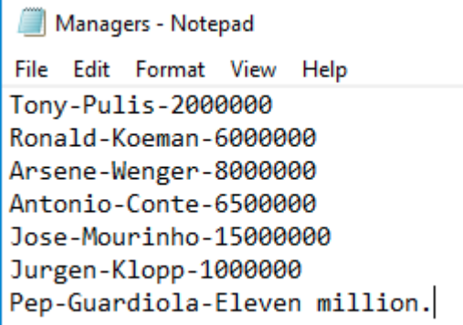

### Assignment 7.1
Create an array to store your weekly lotto numbers.

23,12,10,16,30,32,20

In the program, try to access element 7 in the array (it doesn't exist). Does the
program compile?
* Should we use a try catch block to catch the exception generated?
* Is the exception considered to be a checked or an unchecked exception?

### Assignment 7.2
Create a program, which determines whether a person is entitled to receive a free
bus pass.
When the program runs (at the CMD prompt), the number representing the person’s
age should be passed to the args array, of the main method.

If the person’s age is >= 65, the following message should be displayed:

* You qualify for a free bus pass.

Otherwise, the following message should be displayed:
* You are too young to qualify for a free bus pass.

If the user forgets to enter an argument, the program will crash.
* What is the name of the exception that will be generated?
* Should we handle or declare the exception?
* Is the exception considered a checked or an unchecked exception?

### Assignment 7.3
You have been asked to design a new computer game, which will run in the
terminal

The game is called ‘Lucky Number!’ The program should generate a random / lucky
number, between 0-10 (inclusive).

The player should then be asked to guess the lucky number.
They will be given three guesses.

The player is deemed to have lost the game, if they cannot guess the lucky number.
The player is deemed to have won the game, if they guess the random number
generated by the program.

The player should not be penalised (lose a guess), if they enter invalid data, for
example, entering text for the number, or entering a number outside the game
bounds (<0 and >10).

The player will only lose a guess, if they cannot guess the lucky number in the game
bounds (0 to 10 inclusive).

Any exceptions that may occur should be gracefully handled by the program.

### Assignment 7.4
Create a text file named Duke.txt.

The following text should be included in the text file.

Duke had an amazing day out. He bought an amazing pair of
goggles. What he found most amazing was the price tag. €10!
What an Amazing experience!

Create a Java program, which determines the number of occurrences of the word
‘amazing’ (case insensitive) in the text file.

The program logic should be written in a method named, wordFrequency(). The main
method should call this method and pass it the String, ‘amazing’.

A Scanner object should be used to read the contents of the text file to the program.
Any exceptions that may occur should be gracefully handled by the program.

### Assignment 7.5
Create a text file named Managers.txt (shown below), which stores the names and
salaries of some of the best-known football managers.

Create a Java program, which

(a) reads in the data from the text file
(b) displays the details of each manager (name and salary)
(c) displays the name of the best paid manager.

In the text file, if it happens that a salary is stored as text and not as a number (see
the record for Pep Guardiola), the Java program should display a warning message,
and store the stated salary as 0 (zero).

### Assignment 7.6
Assume that the following daily temperatures were recorded in Ireland, in December
2016.
|           |     |
| --------- | --- |
|01/12/2016 |8    |
|02/12/2016 |9    |
|03/12/2016 |7    |
|04/12/2016 |6    |
|05/12/2016 |11   |
|06/12/2016 |10   |
|07/12/2016 |11   |
|08/12/2016 |8    |
|09/12/2016 |9    |
|10/12/2016 |7    |
|11/12/2016 |7    |
|12/12/2016 |8    |
|13/12/2016 |9    |
|14/12/2016 |7    |
|15/12/2016 |8    |
|16/12/2016 |8    |
|17/12/2016 |7    |
|18/12/2016 |7    |
|19/12/2016 |9    |
|20/12/2016 |7    |
|21/12/2016 |7    |
|22/12/2016 |8    |
|23/12/2016 |9    |
|24/12/2016 |7    |  
|25/12/2016 |6    |
|26/12/2016 |6    |
|27/12/2016 |5    |
|28/12/2016 |4    |
|29/12/2016 |3    |
|30/12/2016 |2    |
|31/12/2016 |2    |

Create a text file named, December_2016.txt, which stores the daily temperatures
for this month. The data should be stored in the following format (date-temperature).

Example:

01/12/2016-8
02/12/2016-9
03/12/2016-7

Now, create a Java program, which reads in the data from the text file and calculates
the following statistics:
* Average temperature
* Max temperature (the warmest day)
* Min temperature (the coldest day)

The program should both (a) display the statistics in the console and (b) write them
out to another text file called, Analysis.txt
